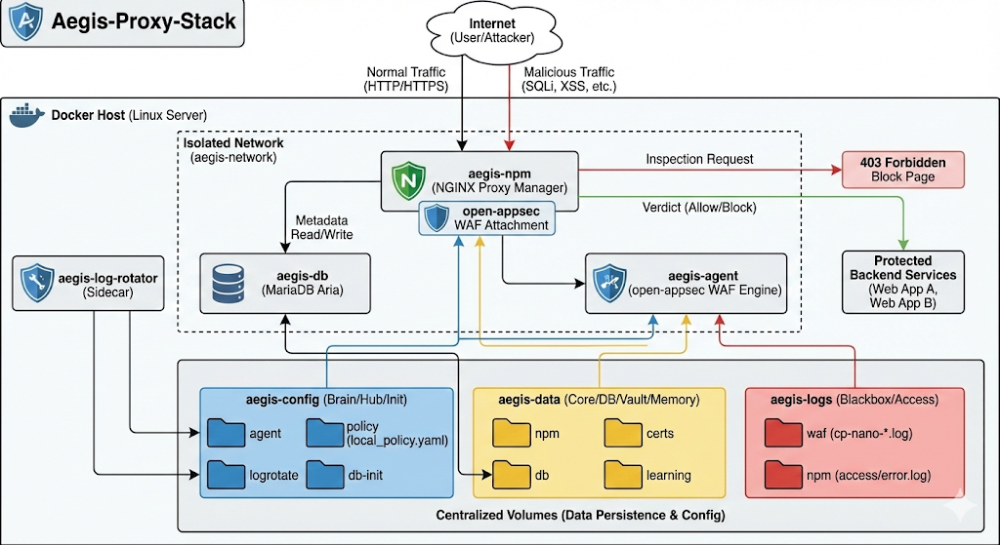
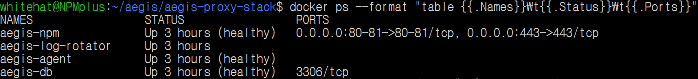
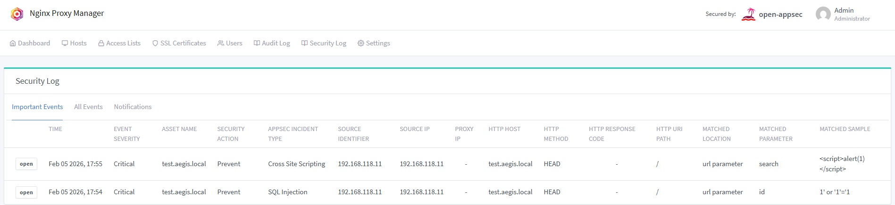

# 🛡️ Aegis-Proxy-Stack

**Aegis-Proxy-Stack**은 [NGINX Proxy Manager(NPM)](https://nginxproxymanager.com/)의 탁월한 사용 편의성에 엔터프라이즈급 보안 솔루션(WAF, IPS, Visualizer)을 결합한 **올인원(All-in-One)** 보안 통합 패키지입니다. 누구나 복잡한 설정 없이 효율적인 웹 방어 체계를 손쉽게 구축할 수 있도록 설계되었습니다.

'**Aegis(이지스)**'는 그리스 신화에서 제우스와 아테나가 사용한 방패를 의미하며, 강력한 보호와 방어를 상징합니다. 여러 보안 계층(WAF, IPS, Visualizer)이 겹겹이 쌓여(Stack) 완벽한 방어를 제공한다는 의미를 담았습니다.

리눅스 환경의 Docker 기반으로 설계되어 즉시 배포가 가능하며, 기계 학습 기반의 제로데이 공격 차단, 집단지성 기반의 IP 평판 분석, 그리고 실시간 지리적 시각화 모니터링을 하나의 통합된 환경에서 제공하며, 나아가 **Aegis 통합 관리 UI**까지 개발하는 것이 목표입니다.



## 🌟 Key Features

* **Core Proxy:** [NGINX Proxy Manager](https://nginxproxymanager.com) 기반의 직관적인 도메인 및 TLS Certificates 관리
* **ML-Based WAF:** [open-appsec](https://www.openappsec.io) 탑재로 OWASP Top 10 및 제로데이 공격에 대한 선제적 방어 (서명 업데이트 불필요)
* **Advanced Machine Learning Model:** [고급 머신러닝 모델](https://docs.openappsec.io/getting-started/using-the-advanced-machine-learning-model)을 적용한 방어체계 구축 **(Phase 2 Completed)**
* **Crowd-Sourced IPS:** [CrowdSec](https://www.crowdsec.net) 통합으로 전 세계 위협 IP 데이터 실시간 공유 및 차단 **(Phase 3 Scheduled)**
* **Real-time Visualization:** [GoAccess](https://goaccess.io)와 [GeoIP2](https://www.maxmind.com) 연동으로 트래픽 및 공격지점 지도 기반 시각화 **(Phase 4 Scheduled)**
* **Aegis Integrated Management UI:** 상기 보안 솔루션 통합 관리를 위한 웹 기반 관리 솔루션 개발 **(Phase 5 Scheduled)**

## 📜 Architecture (Roadmap)

* ✅ **Phase 1:** NGINX Proxy Manager + open-appsec ML-Based WAF Integration
* ✅ **Phase 2:** Using the Advanced Machine Learning Model
* ⬜ **Phase 3:** CrowdSec IPS Integration
* ⬜ **Phase 4:** GoAccess + GeoIP Visualization Setup
* ⬜ **Phase 5:** Aegis Integrated Management UI
* ⬜ **Phase 6:** Integration with other Security Solutions
* ⬜ **Phase 7:** Enhanced Performance and Functionality

## 🛠️ Technical Specifications (기술적 특징)

Aegis-Proxy-Stack은 단순한 통합을 넘어, 운영 안정성과 보안 규제 준수(Compliance)를 고려하여 정교하게 설계되었습니다.

### 1. 보안 강화 아키텍처 (Hardened Security)
* **IPv4 Only & IPv6 Leak Prevention:** IPv6를 통한 우회 공격이나 정보 유출을 방지하기 위해 3중 잠금 장치(Docker Ports, App Environment, Kernel Sysctl)를 적용하여 IPv6 트래픽을 원천 차단했습니다.
* **Isolated Network (네트워크 격리):** `aegis-network`라는 독립된 내부 브리지 네트워크를 사용하여 컨테이너 간 통신을 제어합니다. 특히 데이터베이스(DB)는 호스트 포트를 노출하지 않고 오직 내부망에서만 접근 가능하도록 격리했습니다.

### 2. 규제 준수형 로그 관리 (Compliance-Ready Logging)
* **Log-Rotator Sidecar:** 호스트 OS의 설정에 의존하지 않고, Docker 내부의 독립적인 `log-rotator` 사이드카 컨테이너가 로그를 관리합니다.
* **1-Year Retention:** 보안 규제(ISMS-P 등)를 고려하여 모든 보안 로그는 **365일간 보관**되며, 일 단위(Daily)로 압축(Compress)되어 저장됩니다.
* **Copytruncate Strategy:** 서비스 중단 없는 로그 순환을 위해 `copytruncate` 방식을 채택하여 무중단 운영을 보장합니다.

### 3. 최적화된 데이터베이스 (Optimized Database)
* **MariaDB Aria Engine:** NGINX Proxy Manager에 최적화된 경량화 이미지(`jc21/mariadb-aria`)를 사용하여 리소스 사용량을 최소화했습니다.
* **Modular Init System:** `db-init` 디렉토리를 통해 향후 추가될 보안 모듈(CrowdSec 등)의 DB 스키마를 모듈식으로 자동 확장할 수 있는 구조를 갖추었습니다.

## 🚀 Installation & Getting Started

### 📋 Prerequisites (사전 요구 사항 및 환경 점검)

설치를 진행하기 전에 반드시 아래 사항들을 확인해주세요.

> **보안 권장 사항:** 본 프로젝트는 보안상의 이유로 `root` 계정이 아닌 **`일반 사용자` 계정**으로 설치 및 실행하는 것을 권장합니다.

1. **Docker 설치 및 버전 확인 (필수)**

   터미널에서 아래 명령어를 입력하여 설치된 버전이 아래의 최소 요구사항을 만족하는지 확인합니다.
   * Docker version 20.10.x 이상
   * Docker Compose version v2.0.x 이상
   ```bash
   docker --version
   docker compose version
   ```
   **🚨 Docker가 없거나 버전이 낮은 경우 (해결 방법)**

   아래와 같은 공식 설치 스크립트를 사용하면 최신 버전의 Docker와 Compose가 자동으로 설치(또는 업데이트)됩니다.
   ```bash
   curl -fsSL https://get.docker.com | sudo sh
   ```

2. **사용자 권한 확인 (Docker 그룹 설정)**

   일반 계정에서 `sudo` 없이 Docker 명령어를 실행하려면, 해당 계정이 `docker` 그룹에 포함되어 있어야 합니다.

   **Step 1. 현재 권한 확인**

   터미널에서 아래 명령어를 입력했을 때, 에러 없이 컨테이너 목록(또는 빈 목록)이 나와야 합니다.
   ```bash
   docker ps
   ```
   **🚨 `permission denied` 에러가 발생한다면 아래 Step 2를 진행하세요.**

   **Step 2. Docker 그룹에 사용자 추가 (필요시)**

   현재 사용자를 docker 그룹에 추가 및 그룹 변경 사항 적용을 위해 아래 명령어 실행
   ```bash
   sudo usermod -aG docker $USER 
   newgrp docker
   ```

3. **필수 포트 확인**

   Aegis-Proxy-Stack은 다음 포트를 사용합니다. 해당 포트가 이미 사용 중인지 확인하세요.
   * **80 (HTTP):** 웹 서비스 (Let’s Encrypt Challenge 및 HTTP 트래픽)
   * **81 (Admin):** NGINX Proxy Manager 관리자 웹 콘솔
   * **443 (HTTPS):** 웹 서비스 (TLS 암호화 트래픽)

---

### 🛠️ Step-by-Step Install Guide

1. **작업 환경 구성 (Prepare)**

   프로젝트의 체계적인 관리와 향후 확장성을 위해 `aegis` 전용 디렉토리를 생성하여 설치하는 것을 권장합니다. 아래 모든 과정은 반드시 `root`가 아닌 일반 사용자 계정으로 진행해 주세요.

   사용자 홈디렉토리에 'aegis' 프로젝트 최상위 폴더 생성 후 해당 폴더로 이동합니다. **(옵션 사항)**
   ```bash
   mkdir -p ~/aegis
   cd ~/aegis
   ```

2. **저장소 복제 (Clone Repository)**
   ```bash
   git clone https://github.com/NanumInfo/aegis-proxy-stack.git
   cd aegis-proxy-stack
   ```

3. **설치 스크립트 실행 (Run Interactive Installer)**

   포함된 `install.sh` 스크립트를 실행하면 통합 디렉토리 구조를 생성하고 보안 설정을 완료한 뒤, **서비스 자동 실행 여부**를 묻습니다.
   ```bash
   chmod +x install.sh
   ./install.sh
   ```
   **ℹ️ Info:** 이 스크립트는 `aegis-config`, `aegis-data`, `aegis-logs` 통합 디렉토리 구조를 자동으로 생성하고, 보안 권한(Permission)을 750/600으로 강화합니다.

4. **서비스 실행 (Start Services)**

   설치 스크립트에서 자동 실행을 하지 않았다면 아래 명령어로 실행합니다.
   ```bash
   docker compose up -d
   ```

5. **실행 상태 확인 (Verify)**

   모든 컨테이너가 `healthy` 또는 `Up` 상태인지 확인합니다.
   ```bash
   docker ps --format "table {{.Names}}\t{{.Status}}\t{{.Ports}}"
   ```

   **정상 결과 예시:**
   ```text
   NAMES               STATUS                   PORTS
   aegis-npm           Up 1 minutes (healthy)   80-81/tcp, 443/tcp
   aegis-agent         Up 1 minutes (healthy)   
   aegis-db            Up 1 minutes (healthy)   3306/tcp
   aegis-log-rotator   Up 1 minutes             
   ```
   

   **📝 Note:** 초기 실행 시 데이터베이스 및 WAF 엔진 초기화로 인해 `aegis-npm` 컨테이너가 시작되기까지 약 1~2분이 소요될 수 있습니다.

6. **주요 디렉토리 구조 (Centralized Structure)**

   **Aegis-Proxy-Stack**은 관리 효율성을 위해 모든 디렉토리를 **성격(Config, Data, Logs)에 따라 3개의 대분류로 통합**하였습니다.

   | 대분류 | 하위 경로 (Sub-path) | 성격 (Role) | 설명 및 주요 내용 |
   | :--- | :--- | :--- | :--- |
   | 📂 **`aegis-config`**<br>(설정) | `/agent` | **Brain** | WAF 에이전트 구동을 위한 내부 설정 (Agent ID, `conf` 파일 등). |
   | | `/policy` | **Hub** | **[중요]** 사용자(NPM)와 WAF 간의 정책 공유 디렉토리.<br>핵심 정책 파일인 `local_policy.yaml`이 이곳에 위치합니다. |
   | | `/logrotate` | **Cron** | 로그 파일의 자동 압축 및 삭제 주기를 제어하는 설정 파일.<br>`aegis-rotate.conf`가 위치합니다. |
   | | `/db-init` | **Init** | DB 최초 생성 시 실행되는 초기화 SQL 스크립트 저장소. |
   | 📂 **`aegis-data`**<br>(데이터) | `/npm` | **Core** | NPM의 Nginx 설정, 사용자 계정 정보 등 핵심 상태 데이터. |
   | | `/db` | **DB** | NPM 메타데이터가 저장되는 MariaDB 데이터 파일 (바이너리). |
   | | `/certs` | **Vault** | Let's Encrypt에서 발급받은 SSL 인증서 및 키 파일 원본. |
   | | `/learning` | **Memory** | 머신러닝 모델의 학습 데이터가 저장되는 영속성 공간.<br>이 폴더를 유지해야 AI의 학습 내용이 보존됩니다. |
   | 📂 **`aegis-logs`**<br>(로그) | `/waf` | **Blackbox** | WAF 엔진의 보안 차단 로그(`cp-nano-*.log`) 및 시스템 로그.<br>공격 발생 시 이곳을 확인합니다. |
   | | `/npm` | **Access** | Nginx의 웹 접속 로그(`access.log`) 및 에러 로그(`error.log`). |

## ⚠️ Known Issues & Workarounds (알려진 이슈 및 해결 방법)

### 1. SSL 인증서 발급 시 "Test Reachability" 실패 현상
NPM UI에서 SSL 인증서 발급 시 `JSONObject["responsetime"] not found` 또는 `Unexpected status code` 오류와 함께 도메인 연결 테스트가 실패하는 경우가 있습니다.

> * **원인:** 이는 Aegis-Proxy-Stack의 결함이 아닌, **Nginx Proxy Manager(NPM) 자체의 고질적인 사전 점검 로직 이슈**입니다. NPM 백엔드가 자기 자신의 공인 IP로 접속하여 응답을 확인하는 과정에서 루프백(Loopback) 경로 문제나 보안 모듈의 응답 헤더 간섭으로 인해 발생합니다.
> * **증상:** "Test Reachability" 버튼 클릭 시 에러가 발생하거나, 인증서 발급 창에서 저장 시 경고 팝업이 뜸.
> * **해결 방법 (Workaround):**
>     1. **무시하고 진행:** 사전 테스트 결과와 상관없이 실제 `Certbot`을 통한 인증서 발급은 정상적으로 수행됩니다. 에러 팝업이 뜨더라도 다시 한번 **Save**를 누르면 발급이 완료됩니다.
>     2. **Temporary Disable:** 만약 지속적으로 실패한다면, 해당 Proxy Host를 잠시 **'Disabled'** 상태로 변경한 뒤 인증서를 발급받으세요. 발급 성공 후 다시 'Enabled' 및 'open-appsec ON'으로 설정하면 모든 기능이 정상 작동합니다.

## 🧪 Verification & Testing (검증 및 테스트)

설치가 완료되었다면, 다음 단계에 따라 시스템이 정상적으로 작동하는지 검증합니다.

### 🎯 WAF 동작 테스트 (Attack Simulation)

가장 중요한 단계입니다. 실제로 웹 공격 패턴을 전송하여 WAF가 이를 차단하는지 확인합니다.

* **Step 1. 테스트용 호스트 생성**

   

   ```text
   1. NGINX Proxy Manager 관리자 페이지(`http://서버IP:81`)에 로그인합니다.
       * Default Email: **`admin@example.com`**
       * Default Password: **`changeme`**
   2. **Hosts** > **Proxy Hosts** > **Add Proxy Host** 메뉴를 클릭합니다.
   3. **Details** 탭:
       * Domain Names: `test.aegis.local`
       * Forward Hostname / IP: `127.0.0.1`
       * Forward Port: `81`
   4. **open-appsec**: **토글 스위치 On**
       * Enforcement Mode: **Prevent-Learn** (방어-학습) 선택
       * Minimum confidence for prevent: **Medium** (중간) 선택
   5. **Save** 버튼 클릭
   ```

* **Step 2. 공격 시뮬레이션 (SQL Injection / XSS)**

   터미널에서 `curl` 명령어를 사용하여 공격 패턴이 포함된 요청을 보냅니다.
   *(도메인을 실제 등록하지 않았다면 `-H "Host: ..."` 옵션을 사용합니다)*

   * **정상 요청 (통과되어야 함)**
      ```bash
      curl -I -H "Host: test.aegis.local" "http://서버IP/"
      # 예상결과: HTTP/1.1 200 OK (또는 302/404 등 웹서버 응답)
      ```

   * **SQL Injection 공격 시도 (차단되어야 함)**
      ```bash
      curl -I -H "Host: test.aegis.local" "http://서버IP/?id=1%27%20OR%20%271%27=%271"
      # 예상결과: HTTP/1.1 403 Forbidden
      ```

   * **XSS 공격 시도 (차단되어야 함)**
      ```bash
      curl -I -H "Host: test.aegis.local" "http://서버IP/?search=<script>alert(1)</script>"
      # 예상결과: HTTP/1.1 403 Forbidden
      ```

**🎉 성공 판정:** 공격 패턴이 포함된 요청에 대해 **`403 Forbidden`** 응답이 온다면 WAF가 정상적으로 공격을 방어하고 있는 것입니다.

### 📜 로그 확인 (Log Check)
차단된 공격 기록이 로그 파일에 남는지 확인합니다.

* **Step 1. WAF 보안 로그 실시간 확인**
   ```bash
   sudo tail -f aegis-logs/waf/cp-nano-http-transaction-handler.log* | grep -E "Prevent|Detect"
   ```
* **Step 2. NPM Security Log 확인**
   

**🔄 정상 동작 확인:** WAF 보안 로그와 Security Log에 방금 실행한 `curl` 명령의 차단 내역(SQL Injection, XSS)이 기록되고 표시되어 있어야 합니다.

---

## 🔄 Upgrade Guide (Universal)

**Aegis-Proxy-Stack**은 지속적인 보안 강화와 기능 확장을 위해 통합 업데이트 스크립트를 제공합니다. v0.2.0 이상의 어떤 버전을 사용 중이더라도 아래 절차를 통해 **원하는 버전**으로 안전하게 업데이트할 수 있습니다.

### 🏃 How to Update (업데이트 실행 방법)

터미널에서 아래 명령어를 순서대로 입력하세요. 이 명령어는 최신 버전의 **업데이트 매니저(`update.sh`)**만 우선적으로 가져온 후, 안전하게 전체 시스템 업데이트를 수행합니다.

```bash
# 1. 프로젝트 폴더로 이동
cd ~/aegis-proxy-stack

# 2. 최신 업데이트 스크립트 가져오기 (코드 충돌 방지)
git fetch origin
git checkout origin/main -- update.sh
chmod +x update.sh

# 3. 업데이트 매니저 실행
./update.sh
```

**💡 Tip: update.sh를 실행하면 현재 버전을 자동으로 감지하고, 사용 가능한 최신 버전(v0.3.0 등)으로의 업그레이드를 안내합니다.**

### 주요 변경 사항 (v0.3.0)
* **Phase 2 활성화:** `open-appsec`의 고급 머신러닝(Advanced ML) 모델을 활성화하여 더욱 정밀한 방어 체계를 구축합니다.
* **엔진 바이너리 자동 배포:** 고급 머신러닝 구동에 필수적인 `open-appsec-advanced-model.tgz` 파일이 저장소에 포함되어 있어, 업데이트 시 자동으로 설치됩니다.
* **사용자 설정 보호:** 운영 중 변경되는 `local_policy.yaml` 등의 정책 파일은 업데이트 과정에서 안전하게 보호(Preserve)됩니다.
* **통합 업데이트 스크립트:** `update.sh` 실행 한 번으로 백업, 최신 코드 적용, 설정 마이그레이션이 자동으로 수행됩니다.

**⚠️ 업데이트 시 동작 원리**
* **자동 백업:** 업데이트 시작 전, 전체 시스템(Config, Data, Logs)이 `backups/` 디렉토리에 자동으로 백업됩니다.
* **Docker 설정 자동화:** update.sh는 `docker-compose.yml`을 자동으로 감지 및 수정하여, 새로운 모델 파일을 컨테이너에 마운트합니다.
* **정책 유지:** 사용자가 설정한 기존 WAF 정책(Detection/Prevention 모드 등)은 그대로 유지됩니다.

### ✅ 업데이트 적용 확인 (Verification)
업데이트 완료 후, `update.sh` 스크립트가 출력하는 **상태 확인 리포트**를 참고하세요.

* 만약 상세 상태를 직접 확인하고 싶다면 아래 명령어를 사용하세요.
  ```bash
  docker compose exec agent open-appsec-ctl --status
  ```

---

## ⚖️ License

본 프로젝트는 여러 오픈 소스 프로젝트를 통합한 패키지입니다. 각 구성 요소의 라이선스를 준수합니다.

* **Aegis-Proxy-Stack Configuration:** MIT License
* **open-appsec:** Apache 2.0 (Engine) / Machine Learning Model License (Advanced Model)
* **NGINX Proxy Manager:** MIT License
* **CrowdSec:** MIT License
* **GoAccess:** MIT License